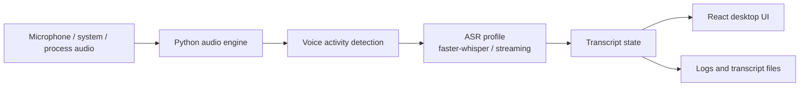
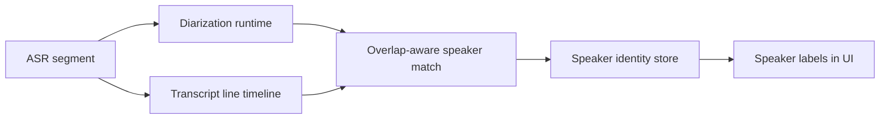
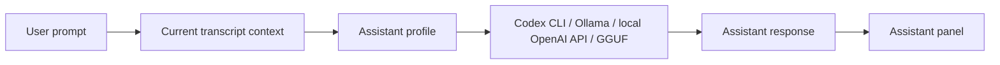
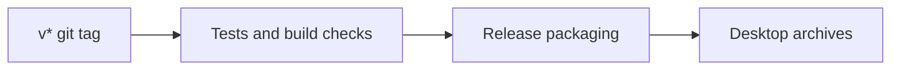

# Meeting Scribe

Meeting Scribe is a desktop app for turning meetings, calls, interviews, and spoken sessions into a live transcript that can immediately be reused by an assistant.

It is built for the moments where taking notes gets in the way of listening. You start a session, capture microphone and system audio, watch the transcript appear, and ask an assistant to summarize, extract decisions, find risks, or answer questions from the current conversation context.

The app runs as an Electron desktop shell with a React UI and a local Python backend. Audio capture, speech recognition, diarization support, transcript storage, and assistant orchestration happen on the user's machine.

## Why It Exists

Meeting Scribe is meant to make spoken work easier to review and act on:

- keep a readable live transcript while a conversation is still happening;
- capture microphone, system audio, or selected app/process audio;
- use faster local ASR profiles for real-time work or heavier profiles for quality;
- preserve transcript artifacts for later review;
- ask an assistant for summaries, action items, follow-up drafts, or checks against the transcript;
- support local-first workflows where audio and transcript data should not have to leave the machine by default.

Typical use cases include product calls, support sessions, interviews, demos, research conversations, planning meetings, and long technical discussions where details matter after the call ends.

## Main Pipelines

### Live Transcription



### Speaker Updates



### Assistant Flow



### Release Build



## Architecture

The project is split into a desktop shell, renderer UI, and Python backend:

- `frontend/electron/` - Electron main process, preload bridge, IPC handlers, dev runner, and renderer URL helpers.
- `frontend/renderer/` - React application, settings UI, transcript view, assistant panel, and frontend tests.
- `backend/main_electron_backend.py` - backend entrypoint used by Electron.
- `backend/src/` - audio capture, ASR orchestration, diarization, transcript domain logic, assistant providers, model management, and runtime configuration.
- `tests/` - Python backend tests.
- `tools/` - release helpers, coverage script, and standalone utilities such as batch transcription.
- `docs/PROJECT_MAP.md` - compact map for agents and contributors.
- `docs/TESTING.md` - testing commands, coverage notes, and test layout.

Electron owns the desktop lifecycle and user-facing IPC surface. The React renderer owns interaction state and presentation. The Python backend owns the actual work: audio, models, transcripts, assistant calls, and persistence.

## Assistant Providers

Assistant profiles can target several provider types:

- `codex` - Codex CLI with the configured command, model, reasoning effort, and optional proxy.
- `ollama` - Ollama HTTP API, defaulting to `http://127.0.0.1:11434`.
- `openai_local` - OpenAI-compatible local HTTP API, defaulting to `http://127.0.0.1:1234/v1` for tools such as LM Studio or llama.cpp server.
- `local` - in-process GGUF model runner through `llama-cpp-python`.

Each profile can keep its own model settings. The assistant uses the current transcript as context, so the same transcript can be summarized, questioned, checked for action items, or transformed into follow-up text without manually copying it out of the app.

## Local Development

Install Node dependencies:

```powershell
npm install
```

Install Python dependencies for the backend according to your environment, then add development-only test tooling when needed:

```powershell
pip install -r requirements/requirements-dev.txt
```

Start the full desktop app:

```powershell
npm run dev
```

The dev runner chooses a free renderer port when the default one is busy and passes the selected URL to Electron. You can still run parts separately:

```powershell
npm run dev:renderer   # React renderer only
npm run dev:electron   # Electron shell when Vite is already running
```

Runtime files are stored in `.local/`. Local model and cache files live under `models/`.

## Testing

Run the full test suite:

```powershell
npm test
```

Run frontend or coverage checks separately:

```powershell
npm run test:frontend
npm run test:coverage:frontend
npm run test:coverage:backend
```

More detail lives in `docs/TESTING.md`.

## Build

Build the renderer:

```powershell
npm run build
```

Build a local Windows package:

```powershell
npm run package:win
```

Release archives are built by GitHub Actions when a `v*` tag is pushed. The current release targets are:

- Windows x64
- Linux x64
- macOS x64
